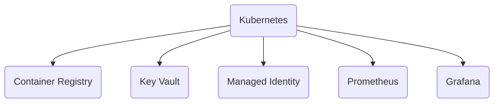
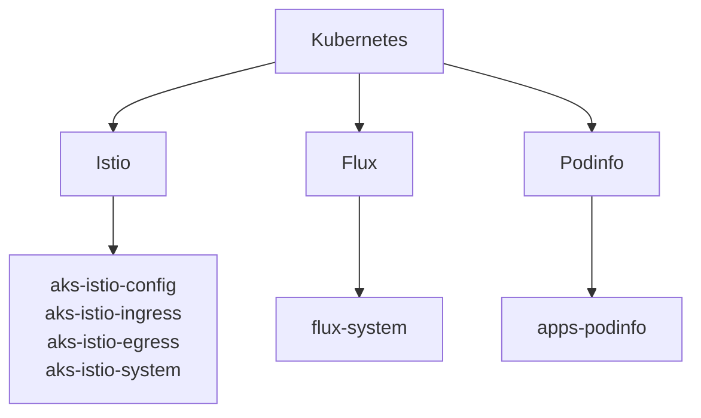

# Istio

This repository contains the infra-as-code components for rapidly provisioning an Azure Kubernetes Service cluster, leveraging Azure Service Mesh (Istio) for managing Ingress & Egress gateways, and mTLS encryption. Additionally, within this cluster, we have implemented the Flux extension for deploying the Podinfo application as a sample use case.

_Please note these artifacts are under development and subject to change._

---

## Getting Started

Before creating the Deployment Stack, the Bicep parameter files need to be updated (`src/main.bicepparam`) with environment specific values.

```bash
az stack sub create \
  --name 'default' \
  --location 'uksouth' \
  --template-file ./src/main.bicep \
  --parameters ./src/main.bicepparam \
  --delete-all \
  --deny-settings-mode none \
  --yes
```

```bash
az stack sub delete \
  --name 'default' \
  --delete-all \
  --yes
```
---

## Architecture

### Azure



---

### Kubernetes


