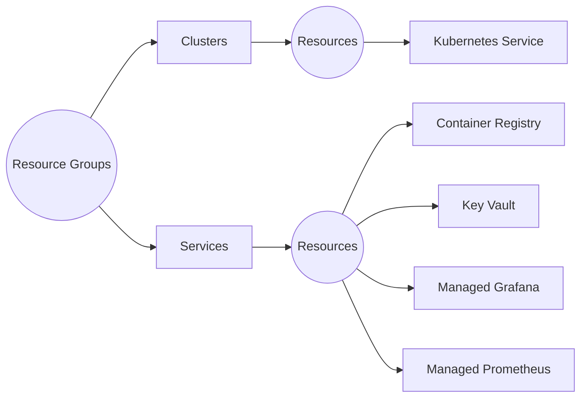
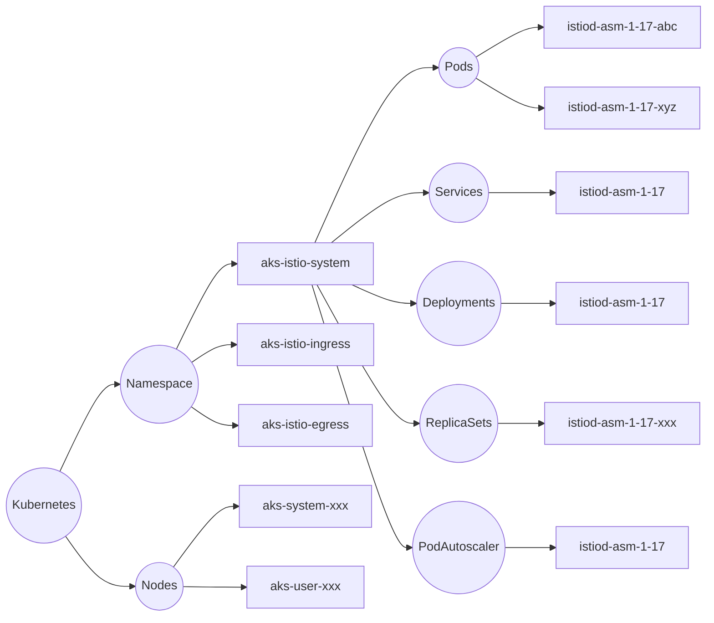

# Istio

This repository contains the infra-as-code components to quickly scaffold a new
Azure Kubernetes Service cluster with Istio service mesh.

_Please note these artifacts are under development and subject to change._

---

## Architecture

### Azure



### Kubernetes



---

## Getting Started

```bash
az stack sub list
```

```bash
az stack sub create \
  --name 'default' \
  --location 'uksouth' \
  --template-file ./src/main.bicep \
  --parameters ./src/main.bicepparam \
  --delete-all \
  --deny-settings-mode none \
  --yes
```

```bash
az stack sub delete \
  --name 'default' \
  --delete-all \
  --yes
```
